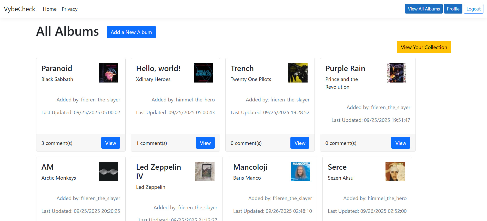
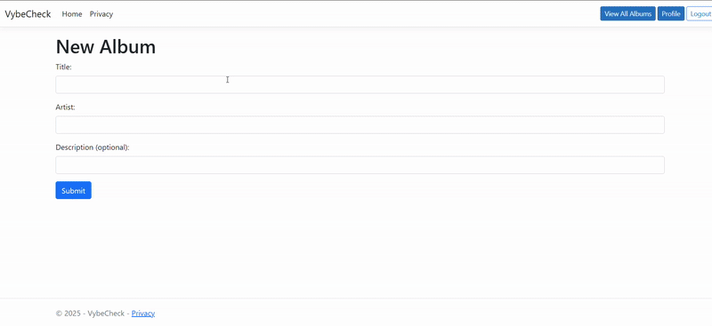

# Vybe Check

A catalogue for music enthusiasts to share their favorite albums and song snippets.

## Demo



## Tech Stack
- .NET (ASP.NET MVC), C#, Entity Framework, MySQL Server
- Bootstrap
- iTunes API [(documented here)](https://developer.apple.com/library/archive/documentation/AudioVideo/Conceptual/iTuneSearchAPI/Searching.html#//apple_ref/doc/uid/TP40017632-CH5-SW1)

## Getting Started
### Prerequisites
- .NET SDK version: 8.0.414
- MySQL Server: 8.0.43

### Setup
1. Clone the repository
2. Configure your SQL connection
3. Apply migrations to create database
4. Run the app

```bash
git clone "https://github.com/bgurkas/VybeCheck.git"
cd VybeCheck
```

### Configuration
#### Add Your SQL Connection String
In `appsettings.json`, add the following lines after `"AllowedHosts"`:
```bash
"ConnectionStrings": {
    "MySql": "server=localhost;user=root;password=<YOUR SQL PASSWORD HERE>;database=vybe_check_db" }
```

#### Call Your Connection String
In `Program.cs`, replace the following lines:
```bash
var dbPassword = builder.Configuration["DbPassword"];
var connect = $"server=localhost;user=root;password={dbPassword};database=vybe_check_db";
```
with this line:
```bash
var connect = builder.Configuration.GetConnectionString("MySql");
```

#### Apply Migrations and Run
```bash
dotnet ef migrations add InitialCreate
dotnet ef database update
dotnet run
```

## Usage
### Registration and Login
- Register an account via the "Register" button on the landing page

### Add an Album
- Click on the "Add a New Album" button
- Fill in the information about the album and submit

### Album View
- Here, you can edit or delete your entry.
- You can also add a snippet of a song from your album.

### Add a Song Snippet
- In the Album Details page, click on "Add a Song Snippet"
- Select your song of choice from the dropdown menu
- You can now play your selected song snippet in the Album Details page.

### Post a Comment
- You can post comments on any user's uploads (including your own) in the Album Details page.

### View Your Profile
- In the navigation bar, click on "Profile" in the top right
- View some basic information about your user profile.

### View Your Collection (Albums Uploaded by You)
- In your profile, click on "View My Collection"
- Alternatively, you can also view your collection from the Index/All Albums page.

## Data Model
Key Entities:
- User
    - Fields: Username, Email, Password
    - Relations: One-to-many with Albums and Comments

- Album
    - Fields: Title, Artist, Description, Genre, Release Date, API-populated fields
    - Relations: One-to-many with User (many-side), and Comments (one-side)

- Comment
    - Fields: User ID, Album ID, Content
    - Relations: One-to-many with Users and Albums (many-side)

## API Endpoints Used
- Search for an album, providing the title and artist names: https://itunes.apple.com/search?term=SEARCH_TERMS_HERE&entity=album&limit=1
- Look up a specific album and all of its tracks, providing the album's ID: https://itunes.apple.com/lookup?id=ALBUM_ID_HERE&entity=song
- Look up a specific song, providing its ID: https://itunes.apple.com/lookup?id=SONG_ID_HERE


## Roadmap
- The minimum viable product (MVP) includes Registration and Login; Creating, Reading, Updating, and Deleting for Albums; Posting Song Snippets; Posting Comments; and Filtering to Each User's Collection.

### Next Steps
- Implementing searching and filtering features.

## Team
- Beril Gurkas (developer, product owner)

## License
MIT
